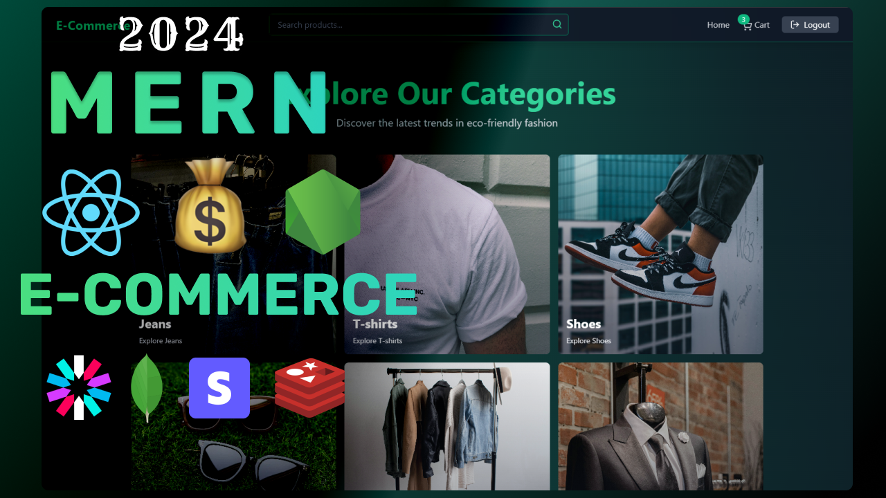

# KalyeKart - Full-Stack E-commerce PWA

Welcome to KalyeKart, a modern, full-stack e-commerce marketplace. This application is designed to be a robust, feature-rich platform for online shopping, complete with an advanced admin dashboard for store management. It is built as a Progressive Web App (PWA), ensuring a fast, reliable, and installable experience on any device.



---

## ✨ Key Features

### For Customers
- **Seamless Shopping Experience:** Browse, search, and filter products with ease.
- **Secure Checkout:** Integrated with Stripe for secure card payments, alongside a "Cash on Delivery" option.
- **User Profiles:** Manage personal information, delivery addresses, and view order history.
- **Real-time Notifications:** Receive updates on order status and other important events via push notifications.
- **Product Reviews:** Leave feedback and ratings on purchased products.

### For Admins
- **Advanced Analytics Dashboard:**
    - **Dynamic Graphs:** The "Overall" sales and revenue graphs automatically adjust their time granularity (daily, monthly, or yearly) based on the total time span of the data, providing the most insightful view possible.
    - **Filtered Statistics:** Easily filter "Total Revenue" and "Total Sales" by daily, weekly, monthly, or yearly periods.
    - **Accurate Revenue Reporting:** Revenue calculations are net of refunds, ensuring the financial data is precise.
- **Comprehensive Management:**
    - **Product Management:** Create, update, and delete product listings.
    - **Order Management:** View and update the status of all customer orders.
    - **Review Management:** Moderate and manage customer reviews.

### Technical Features
- **Progressive Web App (PWA):**
    - **Installable:** Can be added to the home screen of any mobile or desktop device for a native-app-like experience.
    - **Offline Capable:** The service worker caches key assets, allowing the app to load even without a network connection.
- **Full-Stack Architecture:** Built with a modern MERN-like stack (MongoDB, Express, React, Node.js).
- **Secure Authentication:** Uses JWT and cookies for secure user sessions.
- **Push Notifications:** Integrated with Firebase Cloud Messaging (FCM) to engage users with real-time updates.

---

## 🛠️ Tech Stack

- **Frontend:**
    - React
    - Vite
    - Tailwind CSS
    - Zustand (for state management)
    - Recharts (for analytics graphs)
    - Vite PWA Plugin
- **Backend:**
    - Node.js
    - Express
    - MongoDB with Mongoose
    - JSON Web Tokens (JWT)
    - BullMQ (for background job processing)
    - Firebase Admin SDK

---

## 🚀 Getting Started

To get a local copy up and running, follow these simple steps.

### Prerequisites

- Node.js and npm
- MongoDB instance (local or cloud-based)

### Installation

1. **Clone the repo:**
   ```sh
   git clone https://github.com/your-username/kalyekart.git
   ```

2. **Install Backend Dependencies:**
   ```sh
   npm install
   ```

3. **Install Frontend Dependencies:**
   ```sh
   npm install --prefix frontend
   ```

4. **Set up Environment Variables:**
   - Create a `.env` file in the root directory.
   - Add your MongoDB connection string, JWT secrets, Stripe keys, and other necessary credentials.
   - For Firebase, you can either use a `firebase-service-account.json` file in the `backend` directory for local development or set the individual Firebase credential fields as environment variables for production.

5. **Run the Application:**
   ```sh
   npm run start
   ```
   This will concurrently start both the backend server and the frontend development server.